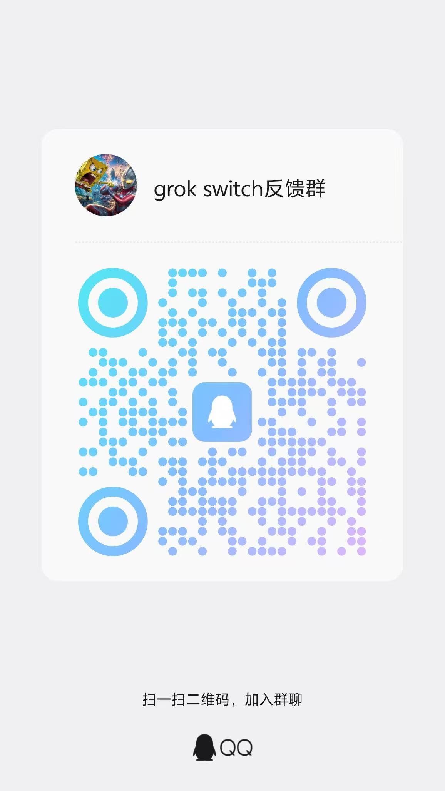

# grok_switch

本地托盘工具：用供应商（Profile）管理 Grok CLI 的 `~/.grok/config.toml`。

一键切换上游 `base_url`、默认模型、联网搜索模型、subagents 与各 `[model.*]` 定义。

## 功能

- 供应商增删改查：名称、Base URL、API Key、上游格式、默认 / 联网 / explore·plan 子代理模型、已启用模型列表
- 供应商默认使用 `high` 推理强度；每个模型自动写入 `supports_reasoning_effort = true` 和 `low/medium/high` 支持列表
- 一键启用：写入 `[endpoints]`、`[models]`、`[subagents.models]`（explore / plan）与 `[model.*]`，其它段尽量保留
- 切换 / 保存 config 前自动备份；设置页可还原备份、直接编辑 `config.toml`
- 首次运行可从当前 `config.toml` 导入 Default 供应商
- 导入 CPA `xai-*.json` 或 Grok CLI `auth.json`，由内嵌代理提供稳定的本地 URL/key 并自动刷新 token
- Grok 多账号池：批量导入、定时自动巡检、健康分类、坏号自动隔离、健康号轮换与单账号回退
- 内置 Grok Build AI 对话工作台：流式回复、工具权限、历史会话续接与工作目录选择
- AI Native 富文本回复：GFM、代码高亮与复制、Mermaid、KaTeX、图片和引用
- Web UI 默认仅监听 `127.0.0.1`；开启局域网访问后监听 `0.0.0.0`（默认端口 `17878`）
- 可选开启局域网手机访问：同一网络内扫码配对后管理供应商或继续 AI 对话
- 可设置Windows 开机自启
- Windows 单实例运行；再次双击 EXE 会打开已运行实例的管理页面
- 启动失败时显示原生错误对话框，并尽可能写入诊断日志
- 托盘菜单：快速切换、打开面板、复制地址、打开数据/日志目录

## 系统要求

| 项目 | 说明 |
|------|------|
| 系统 | **Windows 10 / 11 x64**（当前主要支持） |
| 运行 | 双击 `grok_switch.exe` 即可，**无需**安装 Go / Node |
| 可选 | 本机已安装 [Grok CLI](https://x.ai)，配置目录默认为 `%USERPROFILE%\.grok` |

## 安装与使用

### 在线文档

使用教程、截图说明和联系方式会整理在项目文档站：

[https://1parado.github.io/grok-build-switch/](https://1parado.github.io/grok-build-switch/)

### 方式一：从 Release 下载（推荐）

1. 打开本仓库的 [Releases](../../releases) 页面
2. 下载 `grok_switch.exe`（或压缩包内的 exe）
3. 放到任意目录，双击运行
4. 托盘出现图标；浏览器会打开 `http://127.0.0.1:17878/`（可在设置中关闭「启动时打开面板」）
5. 再次双击 EXE 不会启动第二个后台实例，而是打开已经运行的管理页面

普通用户只需下载并运行，**不需要**配置证书、签名密码、Go 或 Node。发布流程会在
仓库配置了代码签名证书时自动签名；未配置证书的版本仍可直接运行，但 Windows 可能显示
SmartScreen 提示。下方签名配置仅供项目发布维护者使用。


### 方式二：从源码构建

见下方 [构建](#构建)。

### 日常操作

1. **添加供应商**：顶部「添加供应商」→ 填名称、地址、API Key → 可选展开「连接与模型」拉取并启用模型 → **保存并启用**
2. **切换上游**：列表中点目标供应商的 **启用**
3. **查看生效配置**：设置 → `config.toml` 编辑区（磁盘上只有一份生效配置；各供应商档案在本地 profiles 中）
4. **说明**：切换后**不会**结束已运行的 grok 会话；**新开**的 grok 会话才会读新 config

### 手机/平板访问与 AI 对话

1. 在电脑端打开 **设置 → 允许同一局域网的手机访问** 并保存。
2. 确认手机或平板和电脑连接同一个 Wi-Fi 或热点；在“手机连接”区域扫描二维码。
3. 手机或平板完成一次性配对后，会打开同一个页面，可以管理供应商、查看历史对话并继续使用 Grok Build。若浏览器没有保留配对 Cookie，会自动返回配对页面，不会显示服务器内部错误。
4. 配对码有效期为 10 分钟且只能使用一次；需要重新授权时，在电脑端点击“重新生成二维码”。
5. 在手机或平板的对话页面点击右上角“···”打开会话信息，可输入电脑上的工作目录并启动/停止 Agent；点击侧栏外的遮罩可关闭侧栏。

聊天功能要求运行 EXE 的电脑已经安装并登录 Grok Build，且终端中可以执行 `grok`。工具调用、命令和文件读写始终发生在电脑端，手机只作为经过配对的操作界面。

局域网访问默认关闭。启用后只建议在可信的家庭或办公网络中使用，Windows 防火墙只允许
`grok_switch` 通过“专用网络”，不要将端口转发到公网。跨网络访问请使用 Tailscale、
ZeroTier 或 WireGuard 等 VPN。

### 聊天主题背景

聊天工作台右上角的 `◐` 按钮可以切换纯净、霜蓝、深空、余晖背景，或导入本地 PNG、JPEG、WebP 图片。背景支持遮罩强度、模糊与水平/垂直焦点调节。

主题属于当前设备的外观偏好，保存在浏览器/WebView2 本地存储中，不会写入 Grok 会话、API 配置或同步到已配对手机。自定义图片会在本机压缩后保存，原文件不会被移动或修改。

### Grok Auth 与号池

1. 打开 **设置 → Grok Auth JSON**，可导入单个 CPA `xai-*.json` 或 `%USERPROFILE%\.grok\auth.json`；该入口与下方自动巡检使用同一个号池。
2. 需要多账号时，在 **Grok 号池自动巡检** 中一次选择多个 JSON，或用“选择目录导入”递归读取目录及子目录中的全部 `.json`；原文件不会被移动。
3. 默认导入后立即巡检，之后每 6 小时自动巡检一次；可调整为 30–1440 分钟，并设置 1–16 并发。
4. 巡检确认权限拒绝、免费额度用尽或认证失效后，该账号会退出代理可用集合；普通 429/网络异常不会被误隔离。
5. 账号卡片会显示 HTTP 状态、错误码和具体探测错误；可批量禁用或删除所有“已巡检且非健康”的异常账号，待巡检账号不会被处理。
6. 自动巡检不会自动删除账号。手动禁用、启用、单个删除和批量操作均在设置页完成。
7. 无法直连 xAI 时，可填写 HTTP/HTTPS/SOCKS5 代理，例如 `http://127.0.0.1:7890`；该设置同时用于巡检、token 刷新和号池实时转发。

### 环境变量

| 变量 | 说明 |
|------|------|
| `GROK_CONFIG` | 指定 `config.toml` 完整路径 |
| `GROK_HOME` | 指定 `.grok` 目录，默认 `%USERPROFILE%\.grok` |

## 数据与安全

### 数据存在哪

| 路径 | 内容 |
|------|------|
| `%USERPROFILE%\.grok\config.toml` | Grok CLI **当前生效**配置 |
| `%USERPROFILE%\.grok_switch\profiles.json` | 供应商档案（**含 API Key 明文**） |
| `%USERPROFILE%\.grok_switch\backups\` | config 自动备份（**含 Key**） |
| `%USERPROFILE%\.grok_switch\settings.json` | 本工具设置 |
| `%USERPROFILE%\.grok_switch\remote_access.json` | 局域网手机会话与一次性配对凭据（**敏感**） |
| `%USERPROFILE%\.grok_switch\grok_auth.json` | 单账号 xAI OAuth 凭据与本地代理 key（**敏感**） |
| `%USERPROFILE%\.grok_switch\grok_pool\pool.json` | 号池展示状态与巡检/代理设置（不含 token；代理 URL 可能包含认证信息） |
| `%USERPROFILE%\.grok_switch\grok_pool\accounts\` | 号池各账号 OAuth 凭据副本（**敏感**） |
| `%USERPROFILE%\.grok_switch\grok_switch.log` | 日志 |

如果持久化 JSON 因断电、手动编辑或同步软件冲突而损坏，程序会先将原文件重命名为
`<文件名>.corrupt-<时间>.bak`，再恢复安全默认值。恢复过程会写入 `grok_switch.log`，
损坏原件不会被静默覆盖。

## 构建

### 环境

- [Go](https://go.dev/dl/) **1.26+**（与 `go.mod` 保持一致）
- Windows x64
- 可选：`rsrc`（嵌入 exe 图标）、ImageMagick `magick`（从 svg 生成 ico）

```powershell
# 可选：嵌入图标资源
go install github.com/akavel/rsrc@latest
```

### 一键构建

```powershell
.\build.ps1
```

会运行测试并生成 `grok_switch.exe`。

### Wails 桌面 GUI（并行版本）

项目同时提供独立的 Wails v2 桌面构建，不会替换托盘版：

```powershell
.\build-gui.ps1
```

该命令生成 `grok_switch_gui.exe` 和 `grok_switch_gui.exe.sha256`。两个版本用途如下：

| 文件 | 运行方式 |
|------|----------|
| `grok_switch.exe` | 原有托盘 + 浏览器管理界面 |
| `grok_switch_gui.exe` | Wails/WebView2 原生窗口，关闭窗口后隐藏到系统托盘 |

GUI 版复用同一套 Go 服务、Web UI、配置和局域网手机访问。托盘的“供应商”子菜单会显示当前供应商，并可快捷切换官方账号或任意 Profile；供应商在 GUI/Web 页面发生变化后，托盘会自动同步。点击窗口关闭按钮只会隐藏窗口，后台服务仍会继续运行；可从托盘菜单选择“打开 GUI 窗口”恢复，只有选择“退出 grok_switch GUI”才会彻底退出 GUI 及其自有服务。若托盘版已经运行，GUI 会连接现有本地服务，不会重复启动 Agent、代理或 HTTP 监听。Windows 10/11 通常已包含 WebView2 Runtime；缺失时 GUI 会显示安装提示。

以下内容只适用于从源码构建或发布 Release 的维护者，Release 下载用户无需操作。

未配置证书时，本地构建会明确提示这是未签名的开发版本，并同时生成
`grok_switch.exe.sha256`。正式发布应使用 Authenticode 签名：

```powershell
$env:GROK_SWITCH_SIGN_CERT = "C:\secure\grok-switch-signing.pfx"
$env:GROK_SWITCH_SIGN_PASSWORD = "<pfx-password>"
.\build.ps1 -RequireSignature
```

也可以通过当前用户或本机证书库中的 thumbprint 签名：

```powershell
$env:GROK_SWITCH_SIGN_THUMBPRINT = "<certificate-thumbprint>"
.\build.ps1 -RequireSignature
```

仓库的 `Windows Release` 工作流会在推送 `v*` tag 时构建并上传 EXE 与 SHA-256 文件。
配置以下 GitHub Actions Secrets 后会强制执行 Authenticode 签名；未配置时会发布带明确
警告的未签名构建，不会阻塞 Release：

- `WINDOWS_SIGNING_CERT_BASE64`：PFX 文件的 Base64 内容
- `WINDOWS_SIGNING_CERT_PASSWORD`：PFX 密码

证书私钥和密码不得提交到仓库。

### 手动构建

```powershell
go test ./...
go build -ldflags "-s -w -H windowsgui" -o grok_switch.exe .
```

- `-H windowsgui`：无控制台黑窗
- `-s -w`：减小体积


## 开发

```powershell
go test ./...
go run . -no-tray   # 仅 HTTP，无托盘（调试用）
```

### 文档站本地预览

文档站使用 MkDocs Material，内容位于 `docs/`：

```powershell
uvx --with mkdocs-material mkdocs serve
```

打开终端输出的本地地址即可预览。提交到 `main` 后，GitHub Actions 会自动发布到 GitHub Pages。

主要目录：

```
main.go           # 入口
internal/         # 配置读写、供应商、HTTP、托盘
ui/               # Web 前端（嵌入 exe）
assets/           # 图标
docs/             # MkDocs 文档站
```

##

[使用教程](https://1parado.github.io/grok-build-switch/)

## 反馈群

欢迎加入grok build switch 反馈群



## License

[MIT](./LICENSE)

## 友链
学AI 上L站！
[L站链接](https://linux.do/)
