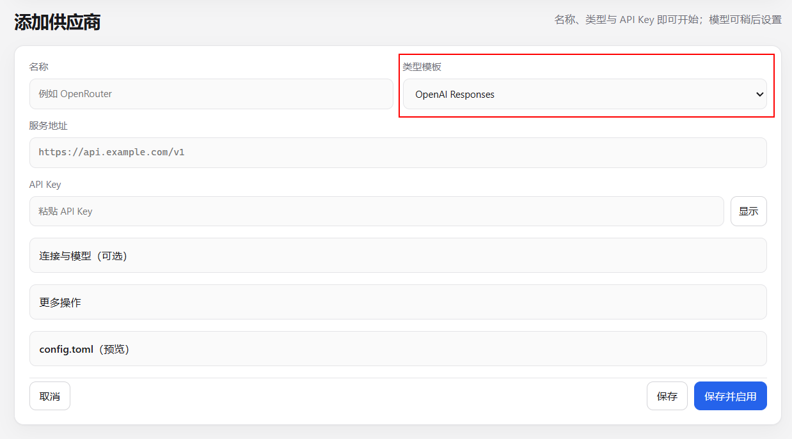
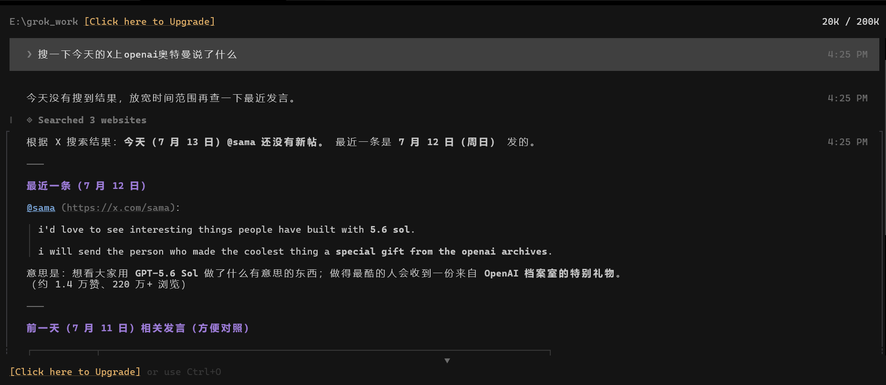
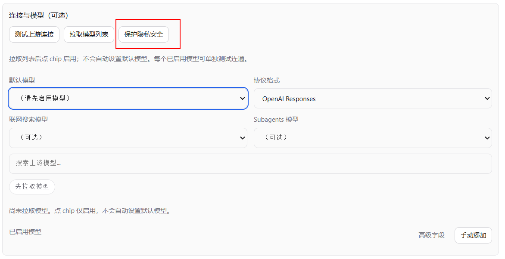
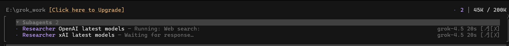

# grok_switch v0.3.0：Responses 联网搜索、隐私保护与 Subagents

v0.3.0 重点补齐了第三方供应商的联网搜索配置。新版本正式支持 OpenAI Responses 协议，将新建供应商的默认模板调整为 Responses，并让每个新启用的模型默认开启后端搜索能力。同时，隐私保护入口被移动到更醒目的位置，Subagents 模型配置也可以帮助 Grok Build 执行更复杂的并行任务。

<!-- more -->

## 为什么以前配置了联网模型，却仍然无法搜索？

在旧版本中，新建供应商通常从“自定义”或 OpenAI 兼容格式开始配置，对应模型会使用：

```toml
api_backend = "chat_completions"
```

虽然 OpenAI Chat Completions 足以完成普通对话，但 Grok Build 的 `web_search` 后端搜索链路需要供应商支持 **Responses API**。因此，即使已经选择了联网搜索模型，或者开启了 `supports_backend_search`，使用 Chat Completions 的第三方上游仍可能无法调用搜索能力。

当模型改为以下配置后，Grok Build 才能通过第三方供应商稳定调用后端搜索：

```toml
[model."grok-4.5"]
model = "grok-4.5"
api_backend = "responses"
supports_backend_search = true
```

需要注意的是，Responses 并不只是一个配置名称：第三方供应商必须真正提供兼容的 `/responses` 接口。如果供应商只支持 `/chat/completions`，仍应选择 OpenAI 兼容格式，但可能无法使用 Grok Build 的后端联网搜索。

## 新建供应商默认使用 Responses

为了减少配置步骤，v0.3.0 将新建供应商时首先展示的类型模板从“自定义”调整为 **OpenAI Responses**。选择模板后，grok_switch 会使用对应的协议配置：

- **OpenAI Responses**：使用 `responses` 后端，推荐用于需要联网搜索的第三方供应商。
- **OpenAI 兼容**：使用 `chat_completions` 后端，适合仅兼容传统 Chat Completions 的供应商。
- **Anthropic**：使用 `messages` 后端，适合 Anthropic Messages 兼容服务。
- **自定义**：保留手动选择协议和调整模型高级字段的能力。



## 已启用模型默认开启后端搜索

新版本为每个新启用的模型默认开启“支持后端搜索”，对应写入：

```toml
supports_backend_search = true
```

如需使用联网能力，还需要在供应商配置中完成以下设置：

1. 上游支持 Responses API。
2. 类型模板或协议格式选择 **OpenAI Responses**。
3. 启用需要使用的模型。
4. 将“联网搜索模型”指向一个已经启用的模型。
5. 保存并启用供应商，然后重新打开 Grok Build 会话。

配置完成后，Grok Build 可以直接搜索实时网页信息，并在回答中展示搜索过程与结果。



## 隐私保护入口更加明显

“保护隐私安全”按钮原本位于折叠的“更多操作”区域中，不容易被注意到。v0.3.0 将它移动到“连接与模型”区域，与“测试上游连接”和“拉取模型列表”放在一起。

点击后，grok_switch 会先备份当前 `config.toml`，再写入关闭遥测、Trace 上传和代码库上传等隐私保护配置，同时尽量保留原文件中的其他设置。



## 使用 Subagents 执行更复杂的任务

正确配置 Subagents 模型后，Grok Build 可以把复杂任务拆分给多个子智能体处理。例如，可以让不同的 Researcher 分别搜索不同来源、分析不同技术方案，最后由主智能体汇总结果。

你可以尝试输入类似的任务：

```text
请调用两个 Researcher 子智能体，分别搜索 OpenAI 和 xAI 的最新模型进展，最后对比总结。
```

执行过程中按下 `Ctrl + B`，可以打开 Grok Build 的任务视图，查看当前运行或等待中的 Subagents、任务名称、所用模型和执行时间。



Subagents 与联网搜索结合后，可以同时检索多个方向的信息，特别适合技术调研、方案对比、资料整理和需要多步骤执行的任务。

## 升级提示

升级到 v0.3.0 前，请先退出旧版 grok_switch 托盘进程，再替换并运行新版 `grok_switch.exe`。原有供应商档案、API Key 和配置备份仍保存在 `~/.grok_switch` 目录中。

切换供应商或修改模型配置后，需要重新打开 Grok Build 会话，新会话才会读取最新的 `config.toml`。
