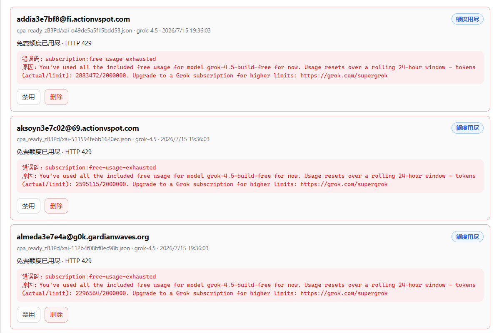
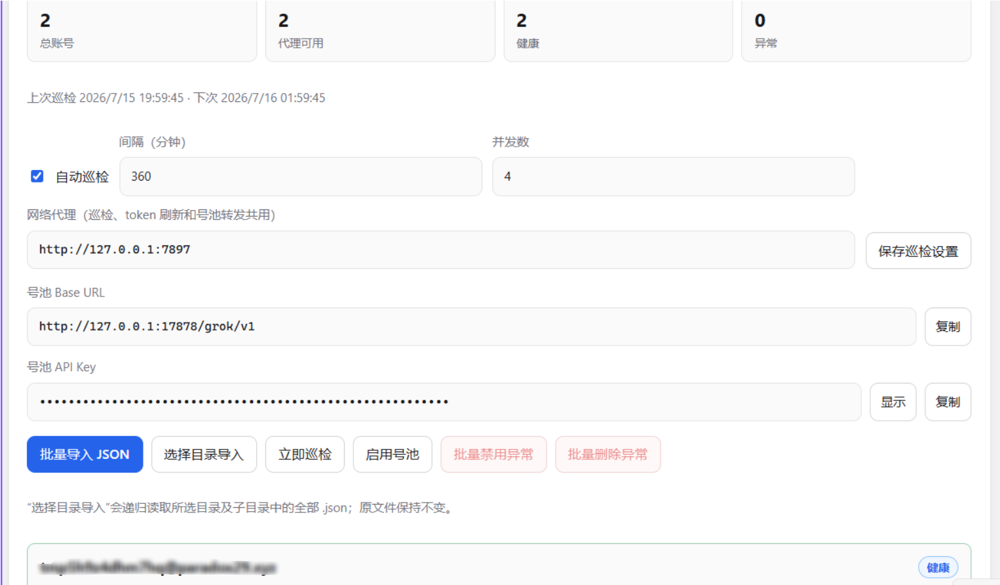
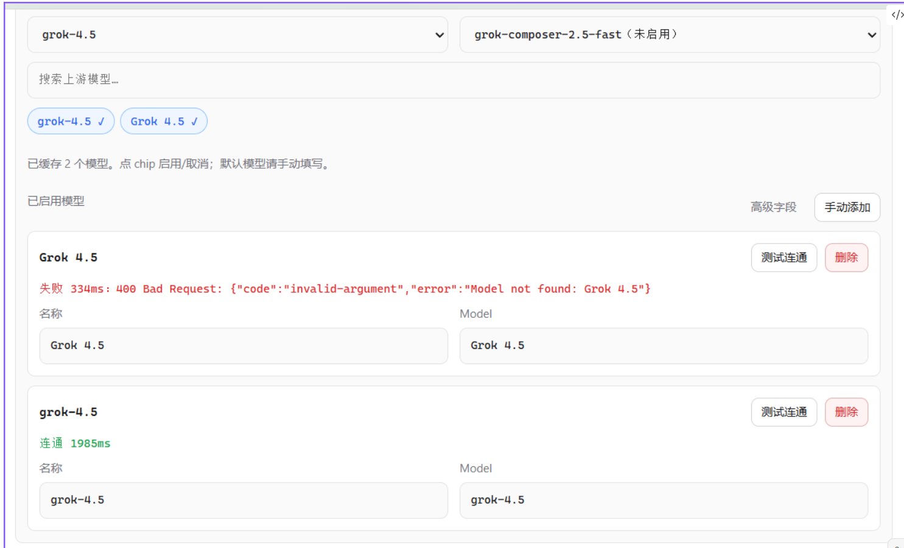
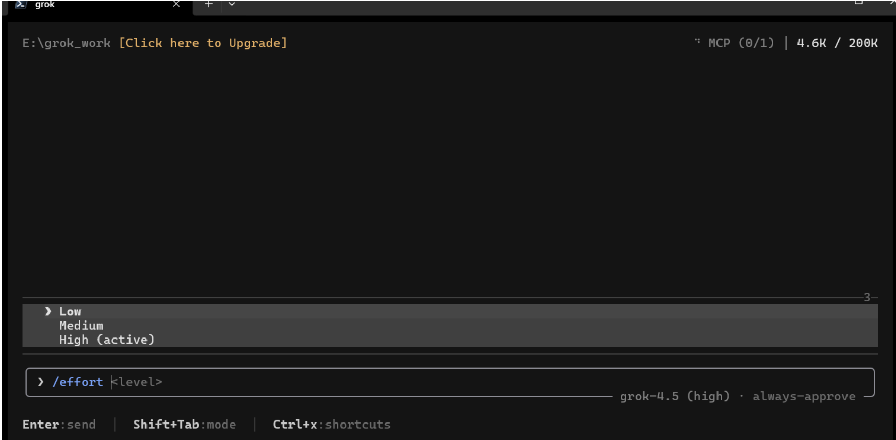

# grok_switch v0.4.0：Grok Auth 号池、自动巡检与推理强度

v0.4.0 将 Grok Auth JSON 导入、账号池和自动巡检整合到了一起。现在可以一次导入多个 JSON，或直接选择一个目录递归导入其中的 JSON 文件；导入的账号会进入同一个号池，经过自动巡检后参与本地代理轮转。此外，新版本还补充了巡检网络代理、异常原因展示、批量禁用与删除、单模型连通性测试，以及默认推理强度配置。

<!-- more -->

## Grok Auth JSON 与自动巡检共用同一个号池

此前，Grok Auth JSON 和账号巡检是两个相对独立的入口。v0.4.0 将它们统一为一个账号池：无论从 Grok Auth 区域导入单个 JSON、批量选择多个 JSON，还是从自动巡检区域导入，账号都会写入同一个号池并触发巡检。

导入方式包括：

- **批量导入 JSON**：一次选择一个或多个 `.json` 文件。
- **选择目录导入**：递归读取所选目录及其子目录内的全部 `.json` 文件，原始文件不会被修改。
- **兼容已有账号**：旧版已经保存的 Grok Auth 会在启动后迁移到统一号池，无需重新逐个导入。

号池会提供本地 Base URL 和独立 API Key。Grok Build 或其他兼容 Responses API 的客户端只需要连接本地地址，grok_switch 会在后端选择健康账号、刷新 OAuth token 并转发请求，因此不需要同时运行 CPA 和其他 Grok 账号切换工具。

## 自动巡检会显示具体失败原因

自动巡检不再只显示“失败”。账号卡片会展示巡检分类、HTTP 状态、结构化错误码和上游返回的原因，便于区分以下情况：

- 免费额度已经用尽；
- 登录失效或无权访问；
- 模型不可用；
- 网络连接或代理异常；
- 普通限流或其他未知错误。

例如，下图中的账号返回 HTTP 429，错误码为 `subscription:free-usage-exhausted`，可以直接确认是免费额度耗尽，而不是 JSON 导入失败。



针对已巡检且状态异常的账号，可以单独禁用或删除，也可以使用“批量禁用异常”和“批量删除异常”一次处理。尚未巡检的账号不会被误判为异常；删除操作只会移除 grok_switch 号池中的凭据副本，不会删除原始导入目录中的 JSON 文件。

## 巡检、token 刷新和转发共用网络代理

如果巡检出现类似下面的错误：

```text
Post "https://cli-chat-proxy.grok.com/v1/responses":
dial tcp ...:443: connectex: A connection attempt failed ...
```

这表示程序未能建立到 Grok 上游的 TCP 连接，通常应先检查本机网络、代理地址和代理软件，而不能据此直接判断账号已经失效。

v0.4.0 可以在巡检设置中填写 HTTP、HTTPS、SOCKS5 或 SOCKS5H 代理。该代理同时用于：

- 自动巡检；
- OAuth token 刷新；
- 号池实时请求转发。

保存设置后可以点击“立即巡检”重新检测。下图中两个账号均已通过巡检，号池统计显示 2 个账号、2 个代理可用、2 个健康账号和 0 个异常账号。



自动巡检默认每 360 分钟执行一次，并发数默认为 4；间隔和并发数都可以在页面中调整。巡检任务不会重叠，在巡检期间继续导入账号时，会在当前任务结束后补跑一轮。

## 模型连通性可以逐个测试

供应商编辑页现在支持对每个已启用模型单独执行“测试连通”。测试结果会直接显示成功、失败、耗时和上游错误，方便在保存配置前排除错误的模型名称。

模型 ID 区分大小写。对于当前 Grok 上游，推荐勾选并使用小写的 `grok-4.5`，取消勾选 `Grok 4.5`。如下图所示，小写模型成功连通，而带大写字母和空格的模型返回 `Model not found`。



模型列表来自上游时，建议仍然通过“测试连通”确认一次，因为部分上游可能同时返回展示名称和真实模型 ID，只有真实模型 ID 能用于接口请求。

## 模型默认支持三档推理强度

v0.4.0 为供应商模型自动补充推理强度配置。默认强度为 `high`，并支持 `low`、`medium` 和 `high` 三档：

```toml
[models]
default_reasoning_effort = "high"

[model."grok-4.5"]
model = "grok-4.5"
api_backend = "responses"
supports_reasoning_effort = true
reasoning_efforts = [
    "low",
    "medium",
    "high",
]
```

保存或启用供应商时，grok_switch 会为每个模型写入相应字段。进入 Grok Build 后，可以使用 `/effort` 在三档强度之间切换；未手动修改时使用 High。



较高的推理强度适合复杂编码、排错和多步骤任务；如果更关注响应速度，可以在当前会话中切换为 Medium 或 Low。

## 升级提示

升级到 v0.4.0 前，请先退出旧版 grok_switch 托盘进程，再替换并运行新版 `grok_switch.exe`。供应商档案、Grok Auth 账号池、巡检设置和历史配置备份保存在 `~/.grok_switch` 目录中。

如果使用网络代理，请确认代理程序已经启动，并在保存代理地址后手动执行一次巡检。修改供应商模型或推理强度配置后，需要重新打开 Grok Build 会话，新会话才会读取最新的 `config.toml`。
